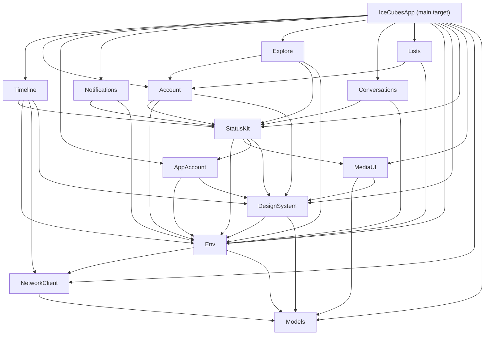

Ice Cubes is a fully open-source Mastodon client built entirely in SwiftUI. Rather than a monolithic codebase, the project is deliberately split into 13 focused Swift packages — each responsible for a distinct layer of the application. This structure makes the code easier to navigate, enables isolated testing per package, and lowers the barrier for new contributors who only need to understand one bounded area at a time.

## Modular package structure

Every major feature or concern lives in its own Swift package under `Packages/`. The separation has two practical benefits: compilation is incremental (changing `StatusKit` does not force `Models` to recompile), and ownership is clear — a contributor working on the post editor touches `StatusKit` without needing to understand timeline caching logic in `Timeline`.

The packages form a layered dependency graph. Foundation packages — `Models`, `NetworkClient`, and `Env` — sit at the bottom and have no dependencies on feature packages. UI feature packages — `Timeline`, `StatusKit`, `Notifications`, `Explore`, and others — import from those lower layers. The main app target imports all packages and wires them together through SwiftUI's environment system.



## State management

Ice Cubes uses straightforward SwiftUI state management — there is no Redux, no Combine-based store, and no global action dispatcher. State lives as close as possible to the view that owns it.

<AccordionGroup>
  <Accordion title="@State — local ephemeral view state">
    Used for transient UI state such as loading flags, selected tab, or text field content. Stays inside the view that declares it.
  </Accordion>
  <Accordion title="@Binding — two-way data flow">
    Passed down from parent to child views when the child needs to mutate parent-owned state, for example the currently selected timeline filter.
  </Accordion>
  <Accordion title="@Observable — shared services">
    Services like `CurrentAccount`, `UserPreferences`, `Theme`, `StreamWatcher`, and `AppAccountsManager` are marked `@Observable` and injected into the view hierarchy via `.environment(...)`. Any view that reads a property on one of these objects automatically re-renders when that property changes.
  </Accordion>
  <Accordion title="@Environment — dependency injection">
    Feature views pull services out of the environment with `@Environment(SomeService.self)`. The app root wires all services in once through the `withAppDependencyGraph` view modifier defined in `AppRegistry.swift`.
  </Accordion>
</AccordionGroup>

<Note>
The codebase contains legacy ViewModels in some older views. New features should not add ViewModels — the modern pattern is Views as pure state expressions with `@State` and `@Observable` services.
</Note>

## Multi-platform navigation

Ice Cubes targets iOS, iPadOS, macOS, and visionOS from a single codebase. Navigation adapts to the platform at runtime using `horizontalSizeClass` and `UIDevice.current.userInterfaceIdiom`.

<CardGroup cols={2}>
  <Card title="iPhone" icon="mobile">
    Tab bar navigation. Tabs are fully customizable. A floating compose button is always reachable. All navigation destinations are pushed onto a `NavigationStack`.
  </Card>
  <Card title="iPad and macOS" icon="laptop">
    Sidebar navigation using `TabView` with `.sidebarAdaptable` style. A secondary column can optionally show notifications alongside the main content. The sidebar lists all sections, local timelines, and tag groups.
  </Card>
  <Card title="visionOS" icon="eye">
    Dedicated visionOS tab set. The post composer opens in its own window via `openWindow` rather than a sheet, taking advantage of the spatial layout model.
  </Card>
  <Card title="Shared logic" icon="layers">
    All three platform paths share the same `AppView`, package logic, and environment graph. Platform differences are handled with `#if os(...)` guards and runtime checks — not separate codebases.
  </Card>
</CardGroup>

## App extensions

The Xcode project ships four app extensions alongside the main target:

| Extension | Purpose |
|---|---|
| `NotificationService` | Decrypts and formats rich push notifications on-device using Apple's `INSendMessageIntent` API. Notification bodies are never readable by the proxy server. |
| `ShareExtension` | Allows users to share a URL or image from any other app directly into the Ice Cubes post composer. |
| `ActionExtension` | Provides quick actions from the system share sheet. |
| `WidgetsExtension` | Home screen and lock screen widgets for the timeline, mentions, and account switching. |

## Swift Concurrency

All network calls use `async/await`. Views use the `.task` modifier for lifecycle-aware async work — tasks launched this way are automatically cancelled when the view disappears. Combine is not used for data loading. The `StreamWatcher` service holds a long-lived WebSocket connection to the Mastodon streaming API and delivers live updates (new posts, edits, deletes) to any active timeline.

```swift
// Typical modern pattern: async loading inside a view
struct TimelineView: View {
    @Environment(Client.self) private var client
    @State private var viewState: ViewState = .loading

    var body: some View {
        Group {
            switch viewState {
            case .loading: ProgressView()
            case .loaded(let statuses): StatusList(statuses: statuses)
            case .error(let error): ErrorView(error: error)
            }
        }
        .task { await loadTimeline() }
    }

    private func loadTimeline() async {
        do {
            let statuses = try await client.getHomeTimeline()
            viewState = .loaded(statuses: statuses)
        } catch {
            viewState = .error(error)
        }
    }
}
```

## Further reading

- [Swift package structure](/architecture/packages) — detailed breakdown of all 13 packages, their responsibilities, and dependency relationships
