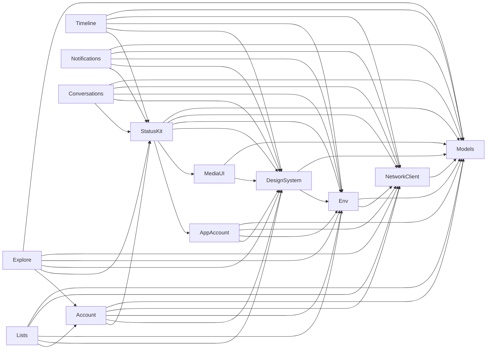

Ice Cubes is split into 13 Swift packages located under `Packages/` in the repository root. Each package has a single, clearly scoped responsibility. This page describes what each package contains, which other packages it depends on, and how the full set composes into a working Mastodon client.

## Packages

<CardGroup cols={2}>
  <Card title="Models" icon="database">
    Mastodon data models: `Status`, `Account`, `Notification`, `MediaAttachment`, `Poll`, `List`, `Relationship`, and more. All Codable structs that map to the Mastodon REST API. No UI, no networking — pure data. Depends only on SwiftSoup for HTML parsing.
  </Card>
  <Card title="NetworkClient" icon="wifi">
    The `MastodonClient` API wrapper that issues authenticated requests to any Mastodon instance. Also contains the `DeepLClient` for translation and the `OpenAIClient` for AI-assisted alt-text generation and hashtag suggestions. Depends on `Models`.
  </Card>
  <Card title="Env" icon="globe">
    App-wide environment objects injected via SwiftUI's `@Environment`. Key types: `CurrentAccount`, `CurrentInstance`, `UserPreferences`, `StreamWatcher`, `PushNotificationsService`, `RouterPath`, and `Theme`. This is the shared state backbone of the app. Depends on `Models` and `NetworkClient`.
  </Card>
  <Card title="DesignSystem" icon="paintbrush">
    Theming system, color palette, typography, and reusable UI primitives. Provides `Theme` configuration, `EmojiText` rendering, image loading via Nuke, and Gifu-based GIF playback. Depends on `Models` and `Env`.
  </Card>
  <Card title="AppAccount" icon="key">
    Multi-account management. `AppAccountsManager` tracks all signed-in accounts, persists OAuth tokens securely in the keychain, and exposes the active `MastodonClient`. Login, logout, and account switching flow through this package. Depends on `NetworkClient`, `Models`, `Env`, and `DesignSystem`.
  </Card>
  <Card title="Account" icon="user">
    Profile views and account management UI: `AccountDetailView`, `EditAccountView`, `FiltersListView`, `AccountSettingsView`, and `AccountDetailMediaGridView`. Handles follow/unfollow actions, bio editing, custom fields, and server-side note support. Depends on `NetworkClient`, `Models`, `StatusKit`, `Env`, and `DesignSystem`.
  </Card>
  <Card title="StatusKit" icon="message-square">
    Post display and the post editor. Renders a `Status` in all its variants (boosts, polls, media, content warnings, quote posts). Also contains `StatusEditor.MainView` — the full-featured composer supporting threads, images, polls, alt-text AI generation, and draft save/restore. Depends on `AppAccount`, `Models`, `MediaUI`, `NetworkClient`, `Env`, and `DesignSystem`.
  </Card>
  <Card title="Timeline" icon="list">
    Timeline views and all timeline filtering logic: home, local, federated, trending, hashtag, list, tag group, and link timelines. Manages unread post counting, iCloud-synced position via the Mastodon marker API, and home timeline disk caching via Bodega. Depends on `NetworkClient`, `Models`, `Env`, `StatusKit`, and `DesignSystem`.
  </Card>
  <Card title="Notifications" icon="bell">
    Notification list views, grouping/stacking logic, and `NotificationsRequestsListView`. Renders all Mastodon notification types (mentions, favourites, boosts, follows, polls, etc.) using `StatusKit` row components. Depends on `NetworkClient`, `Models`, `Env`, `StatusKit`, and `DesignSystem`.
  </Card>
  <Card title="Explore" icon="search">
    The Explore tab: trending posts, users, hashtags, and links. Includes the instance-wide search UI with filtering by accounts, statuses, or tags, trending tag activity graphs, and `TrendingLinksListView`. Depends on `Account`, `NetworkClient`, `Models`, `Env`, `StatusKit`, and `DesignSystem`.
  </Card>
  <Card title="Conversations" icon="messages-square">
    Direct message (conversation) UI. `ConversationsListView` shows all active DM threads with a chat-like layout. `ConversationDetailView` displays a single thread with inline reply support. Depends on `Models`, `NetworkClient`, `Env`, `DesignSystem`, and `StatusKit`.
  </Card>
  <Card title="Lists" icon="layout-list">
    Mastodon list management: `ListCreateView`, `ListEditView`, and `ListAddAccountView`. Users can create, rename, and manage membership of server-side lists that then appear as timeline sources in the `Timeline` package. Depends on `Account`, `NetworkClient`, `Models`, `Env`, and `DesignSystem`.
  </Card>
  <Card title="MediaUI" icon="image">
    Full-screen media viewing: pinch-to-zoom images, video playback, and share sheet integration. `QuickLook` is the `@Observable` service that drives the media overlay. Depends on `Models` and `DesignSystem`.
  </Card>
</CardGroup>

## Dependency diagram

The packages form a strict acyclic dependency graph. Foundation packages have no cross-package imports; UI feature packages layer on top of them.

**Foundation layer** — `Models`, `NetworkClient`, `Env`, `DesignSystem`, `MediaUI`: no dependencies on feature packages.

**Shared UI layer** — `AppAccount`, `StatusKit`, `Account`: building blocks imported by multiple feature packages.

**Feature layer** — `Timeline`, `Notifications`, `Explore`, `Conversations`, `Lists`: each assembles the layers below it into a self-contained feature.

## Related pages

- [Architecture overview](/architecture/overview) — high-level philosophy, navigation model, app extensions, and concurrency patterns
